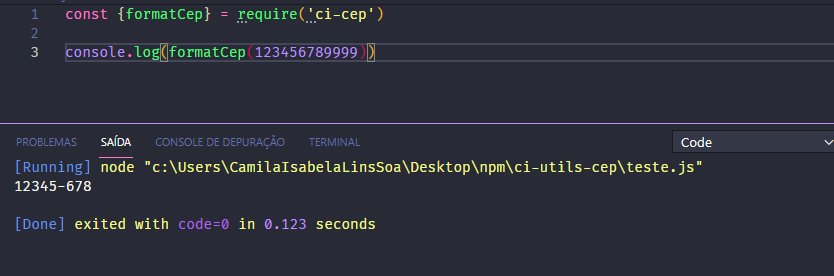

# Criando um package no npm para formatar o CEP

## 1. Instale o pacote npm com o comando: 
~~~~javascript
npm i ci-cep
~~~~
## 2. Depois crie uma variável para receber o pacote:

~~~ javascript
const {formatCep} = require("ci-cep");
~~~

## E "voilà"! Está feita a conversão do cep 😉

