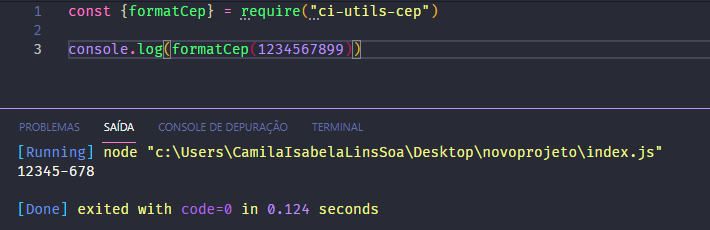

# Criando um package no npm para formatar o CEP

## 1. Instale o pacote npm com o comando --> npm i ci-utils-cep

## 2. Depois crie uma variável para receber o pacote. Exemplo: 

<code> const {formatCep} = require("ci-utils-cep");</code> 

## E "voilà"! Está feita a conversão do cep

